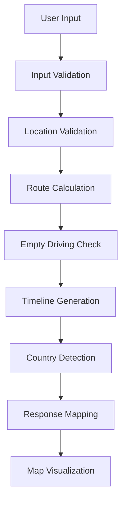
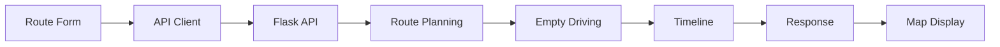
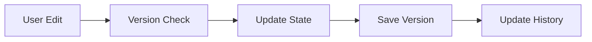
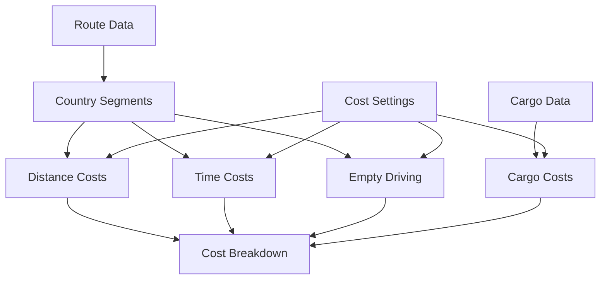

# LoadApp.AI System Architecture (PoC)

## Overview

This document outlines the system architecture for the LoadApp.AI Proof of Concept, focusing on route planning, cost calculation, offer generation, and state management. The architecture follows a layered approach with clear separation of concerns:

- **Presentation Layer (Frontend/UI)**: Streamlit-based web interface for user interactions
- **Service Layer (Backend)**: Flask RESTful API for route planning, cost calculations, and offer generation
- **Data Layer (Persistence)**: SQLite database for data persistence
- **Integration Layer**: External service integrations (future expansion)

## Architectural Principles

1. **Modularity & Separation of Concerns**
   - Each layer has distinct responsibilities
   - Clear boundaries between frontend, backend, and data layers
   - Independent evolution of components

2. **Simplicity & Extensibility**
   - Start with simple, proven technologies (SQLite, Flask, Streamlit)
   - Design for future scaling (e.g., PostgreSQL, caching layers)
   - Avoid premature optimization

3. **API-Centric Design**
   - Clean RESTful API as the primary interface
   - Consistent endpoint patterns
   - Comprehensive error handling
   - Version control for all resources

4. **Data-Driven Configuration**
   - Cost settings stored in database
   - Transport types and cargo definitions as data
   - Runtime modifications without code changes
   - Version tracking for all settings

5. **Error Handling & Logging**
   - Consistent error response format
   - Detailed logging of key actions
   - Audit trail for important changes
   - Clear error messages for users

## System Components

### 1. Frontend (Streamlit)
- **Route Planning UI**
  - Interactive form for route input:
    - Location picker with address validation
    - Time window selection with validation
    - Transport type selection
    - Cargo specification input
  - Map visualization component:
    - Route segments with country borders
    - Empty driving segments highlighted
    - Timeline events marked
    - Interactive tooltips
  - Timeline visualization:
    - Pickup and delivery events
    - Rest periods
    - Border crossings
    - Loading/unloading times
- **Cost Management UI**
  - Cost breakdown display
  - Settings management
  - History tracking
- **Offer Management UI**
  - Offer creation and editing
  - Version history and comparison
  - Status management
  - Advanced filtering
- **State Management**
  - Centralized state container
  - React-like hooks for state access
  - Form validation and business rules
  - Loading and error states
  - Version control
- **API Integration**
  - API client for backend communication
  - Error handling and user feedback

### 2. Backend (Flask)
- **API Layer**
  - Route planning endpoints:
    - Route creation with validation
    - Route retrieval with full details
    - Error handling and responses
  - Cost calculation endpoints
  - Settings management endpoints
  - Offer management endpoints
  - Version control
  - Status management
  - Data validation
  - Error handling
- **Core Logic**
  - Route segment calculation:
    - Distance and duration calculation
    - Empty driving detection (200km/4h rule)
    - Country border detection
    - Timeline event generation
  - Cost calculation
    - Distance-based costs
    - Time-based costs
    - Empty driving costs
    - Cargo-specific costs
  - Version tracking
  - History management

### 3. Data Models
- **Location**
  - Address components
  - Coordinates
  - Country information
  - Validation rules
- **TimeWindow**
  - Earliest/latest times
  - Duration constraints
  - Timezone handling
- **TransportType**
  - Vehicle specifications
  - Special equipment
  - Capacity constraints
- **CargoSpecification**
  - Weight and volume
  - Special requirements
  - Hazmat information
- **RouteSegment**
  - Start/end locations
  - Distance and duration
  - Empty driving status
  - Timeline events
  - Country information
- **Route**
  - Origin/Destination
  - Pickup/Delivery times
  - Transport specifications
  - Country segments
  - Time windows
- **Cost**
  - Distance-based components
  - Time-based components
  - Empty driving components
  - Cargo-specific components
  - Version tracking
  - Validity periods
- **Cost Settings**
  - Country-specific rates
  - Cargo factors
  - Empty driving factors
  - Version control
  - Validity periods
- **Offer**
  - Version tracking
  - Status management
  - History tracking
  - Audit fields
  - Extension points
- **Offer History**
  - Version data
  - Change tracking
  - User actions

### 4. Error Handling Strategy

#### 4.1 Frontend Error Handling
- Form validation with immediate feedback
- API error translation to user-friendly messages
- Loading states and error states
- Retry mechanisms for transient failures

#### 4.2 Backend Error Handling
- Request validation at API layer
- Business rule validation in service layer
- Consistent error response format
- Detailed error logging
- Transaction management

#### 4.3 Error Response Format
```json
{
  "status": "error",
  "code": "VALIDATION_ERROR",
  "message": "User-friendly message",
  "details": {
    "field": "specific_field",
    "reason": "Technical details"
  }
}
```

### 5. Logging Strategy

#### 5.1 Key Events
- Route creation and updates
- Cost calculation requests
- Offer generation and status changes
- Settings modifications
- Error conditions

#### 5.2 Log Format
```json
{
  "timestamp": "ISO datetime",
  "level": "INFO|WARN|ERROR",
  "event": "EVENT_TYPE",
  "details": {},
  "user": "user_id",
  "version": "api_version"
}
```

## Error Handling Architecture

### 1. Error Hierarchy
```python
class LoadAppError(Exception):
    """Base error class for LoadApp.AI"""
    def __init__(self, message: str, code: str, details: Dict = None):
        self.message = message
        self.code = code
        self.details = details or {}
        super().__init__(message)

class ValidationError(LoadAppError):
    """Input validation errors"""
    def __init__(self, message: str, details: Dict = None):
        super().__init__(message, "VALIDATION_ERROR", details)

class BusinessRuleViolation(LoadAppError):
    """Business rule violations"""
    def __init__(self, message: str, details: Dict = None):
        super().__init__(message, "BUSINESS_RULE_VIOLATION", details)

class VersionConflictError(LoadAppError):
    """Version control conflicts"""
    def __init__(self, current: str, provided: str):
        details = {"current_version": current, "provided_version": provided}
        super().__init__("Entity has been modified", "VERSION_CONFLICT", details)
```

### 2. Error Handling Strategy

#### 2.1 API Layer
```python
@app.errorhandler(LoadAppError)
def handle_loadapp_error(error):
    return {
        "status": "error",
        "error": {
            "code": error.code,
            "message": error.message,
            "details": error.details
        }
    }, get_status_code(error.code)

def get_status_code(error_code: str) -> int:
    return {
        "VALIDATION_ERROR": 400,
        "RESOURCE_NOT_FOUND": 404,
        "VERSION_CONFLICT": 409,
        "BUSINESS_RULE_VIOLATION": 422,
        "INTERNAL_ERROR": 500
    }.get(error_code, 500)
```

#### 2.2 Service Layer
```python
class BaseService:
    def handle_errors(self, operation: Callable):
        try:
            return operation()
        except ValidationError as e:
            log.warning(f"Validation error: {e.message}", extra=e.details)
            raise
        except BusinessRuleViolation as e:
            log.warning(f"Business rule violation: {e.message}", extra=e.details)
            raise
        except Exception as e:
            log.error(f"Unexpected error: {str(e)}", exc_info=True)
            raise LoadAppError("Internal server error", "INTERNAL_ERROR")
```

## Logging Strategy

### 1. Logging Configuration
```python
import logging
import structlog

def configure_logging():
    """Configure structured logging"""
    logging.basicConfig(level=logging.INFO)
    
    structlog.configure(
        processors=[
            structlog.processors.TimeStamper(fmt="iso"),
            structlog.processors.StackInfoRenderer(),
            structlog.processors.format_exc_info,
            structlog.processors.JSONRenderer()
        ],
        context_class=dict,
        logger_factory=structlog.PrintLoggerFactory(),
        wrapper_class=structlog.BoundLogger,
        cache_logger_on_first_use=True,
    )

log = structlog.get_logger()
```

### 2. Logging Patterns

#### 2.1 Request Logging
```python
@app.before_request
def log_request():
    log.info(
        "request_started",
        path=request.path,
        method=request.method,
        client_ip=request.remote_addr
    )

@app.after_request
def log_response(response):
    log.info(
        "request_finished",
        path=request.path,
        method=request.method,
        status=response.status_code,
        duration_ms=get_request_duration()
    )
    return response
```

#### 2.2 Business Event Logging
```python
class BusinessEventLogger:
    def log_route_created(self, route: Route):
        log.info(
            "route_created",
            route_id=str(route.id),
            origin=route.origin.address,
            destination=route.destination.address,
            segments=len(route.segments),
            version=route.version
        )
    
    def log_cost_calculated(self, cost: Cost):
        log.info(
            "cost_calculated",
            route_id=str(cost.route_id),
            total=cost.total,
            settings_version=cost.settings_version,
            version=cost.version
        )
    
    def log_offer_status_changed(self, offer: Offer, old_status: str):
        log.info(
            "offer_status_changed",
            offer_id=str(offer.id),
            route_id=str(offer.route_id),
            old_status=old_status,
            new_status=offer.status,
            version=offer.version
        )
```

## State Management

### 1. Frontend State Management
```python
class AppState:
    """Centralized state container for Streamlit"""
    def __init__(self):
        self.route: Optional[Route] = None
        self.cost: Optional[Cost] = None
        self.offer: Optional[Offer] = None
        self.error: Optional[Dict] = None
        self.loading: bool = False
        
    def set_route(self, route: Route):
        """Update route and clear dependent state"""
        self.route = route
        self.cost = None
        self.offer = None
        self.error = None
        
    def set_cost(self, cost: Cost):
        """Update cost and clear offer"""
        self.cost = cost
        self.offer = None
        self.error = None
        
    def set_offer(self, offer: Offer):
        """Update offer state"""
        self.offer = offer
        self.error = None
        
    def set_error(self, error: Dict):
        """Set error state"""
        self.error = error
        self.loading = False
        
    def clear_error(self):
        """Clear error state"""
        self.error = None
```

### 2. Form State Management
```python
class FormState:
    """Form state management with validation"""
    def __init__(self):
        self.values: Dict[str, Any] = {}
        self.errors: Dict[str, str] = {}
        self.touched: Set[str] = set()
        
    def set_value(self, field: str, value: Any):
        """Update field value and validate"""
        self.values[field] = value
        self.touched.add(field)
        self.validate_field(field)
        
    def validate_field(self, field: str):
        """Validate single field"""
        self.errors[field] = None
        validator = self.get_validator(field)
        if validator:
            error = validator(self.values[field])
            if error:
                self.errors[field] = error
                
    def validate_all(self) -> bool:
        """Validate all fields"""
        for field in self.values:
            self.validate_field(field)
        return not any(self.errors.values())
```

### 3. API State Management
```python
class APIState:
    """API state management with caching"""
    def __init__(self):
        self.settings_cache: Dict[str, Any] = {}
        self.route_cache: Dict[UUID, Route] = {}
        self.cost_cache: Dict[UUID, Cost] = {}
        
    def cache_settings(self, settings: Dict):
        """Cache settings with version"""
        self.settings_cache[settings["version"]] = settings
        
    def get_settings(self, version: Optional[str] = None) -> Optional[Dict]:
        """Get settings by version"""
        if version:
            return self.settings_cache.get(version)
        # Get latest version
        versions = sorted(self.settings_cache.keys())
        return self.settings_cache.get(versions[-1]) if versions else None
        
    def cache_route(self, route: Route):
        """Cache route with version"""
        self.route_cache[route.id] = route
        
    def invalidate_route(self, route_id: UUID):
        """Invalidate route and dependent caches"""
        self.route_cache.pop(route_id, None)
        self.cost_cache.pop(route_id, None)
```

## Implementation Guidelines

### 1. Error Handling Guidelines
- Use specific error types for different scenarios
- Include relevant context in error details
- Log errors with appropriate severity
- Provide user-friendly error messages
- Maintain error code consistency

### 2. Logging Guidelines
- Log all significant business events
- Include relevant context in log entries
- Use structured logging format
- Maintain consistent log levels
- Avoid logging sensitive data

### 3. State Management Guidelines
- Keep state updates atomic
- Clear dependent state when parent changes
- Validate state transitions
- Cache frequently accessed data
- Handle loading and error states

## Implementation Status

### Completed Features
1. **Route Planning**
   - Route creation with validation
   - Empty driving detection
   - Country-specific segments
   - Timeline events
   - Map visualization
   - Interactive tooltips

2. **Cost Calculation**
   - Distance-based costs
   - Time-based costs
   - Empty driving costs
   - Cargo-specific costs
   - Settings management
   - History tracking

3. **Frontend Integration**
   - API client implementation
   - Form validation
   - Map visualization
   - Cost breakdown display
   - Settings management UI
   - Error handling

4. **State Management**
   - Centralized state container
   - React-like hooks
   - Form validation
   - Loading states
   - Error handling
   - Version control

5. **Offer Management**
   - Version tracking
   - Status management
   - History tracking
   - Audit fields
   - Extension points
   - Advanced filtering

### Future Extensions
1. **Cost Optimization**
   - Dynamic pricing models
   - Cost optimization
   - Margin analysis

2. **Route Optimization**
   - Multiple stop support
   - Alternative route suggestions
   - Time window optimization

3. **Analytics**
   - Offer performance metrics
   - Cost analysis
   - Version analysis
   - User activity tracking

## Technical Decisions

### 1. Framework Selection
- **Frontend**: Streamlit
  - Rapid development
  - Built-in UI components
  - Custom state management
- **Backend**: Flask
  - Lightweight
  - Easy to extend
  - Good documentation

### 2. Route Planning Flow


### 3. Data Flow


### 4. Version Control


### 5. Status Management


### 6. Cost Calculation Flow


## Testing Strategy

### Manual Testing
1. Route Creation Flow
   - Location input validation
   - Time window validation
   - Transport type selection
   - Cargo specification
   - Empty driving detection
   - Timeline generation

2. Cost Calculation Flow
   - Settings management
   - Cost breakdown display
   - History tracking

3. Offer Management Flow
   - Version control
   - Status transitions
   - History tracking

4. State Management
   - State updates
   - Loading states
   - Error handling

### Automated Testing
1. Frontend Tests
   - State management
   - Form validation
   - API integration
   - Version control
   - Status transitions
   - Cost calculations

2. API Tests
   - Endpoint validation
   - Version control
   - Status management
   - Cost calculation
   - Error handling

3. Integration Tests
   - End-to-end workflows
   - State synchronization
   - Version integrity
   - Cost accuracy

## Deployment

### Local Development
```bash
# Backend
python src/backend/app.py

# Frontend
streamlit run src/frontend/app.py
```

### Dependencies
- Python 3.8+
- Streamlit
- Flask
- SQLAlchemy
- Required Python packages in requirements.txt

## Next Steps

1. **Route Optimization**
   - Multiple stop support
   - Alternative routes
   - Real-time traffic
   - Weather conditions
   - Advanced rest periods

2. **Technical Improvements**
   - Performance optimization
   - State persistence
   - Caching strategy
   - Real-time updates
