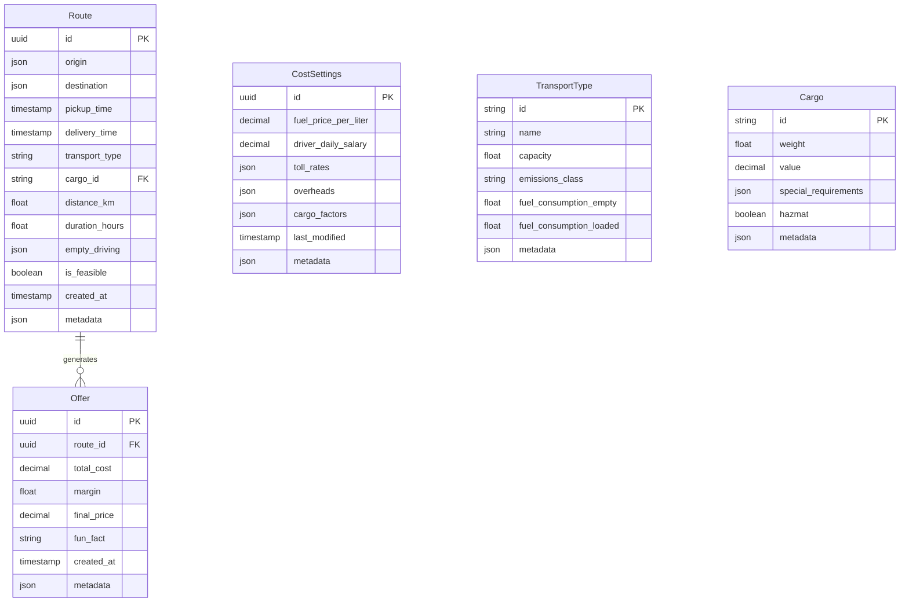

# LoadApp.AI Database Schema

## Entity Relationship Diagram

## Relationships

1. **Route to Offer** (1:Many)
   - A Route can have multiple Offers
   - Each Offer belongs to exactly one Route

2. **Route to Cargo** (Many:1)
   - A Route references one Cargo
   - A Cargo can be associated with multiple Routes

3. **Route to TransportType** (Many:1)
   - A Route references one TransportType
   - A TransportType can be used in multiple Routes

## Constraints

### Route
- `id`: UUID primary key
- `pickup_time` must be before `delivery_time`
- `distance_km` and `duration_hours` must be positive
- `empty_driving` JSON must contain `distance_km` and `duration_hours`
- `origin` and `destination` JSON must contain `address`, `latitude`, and `longitude`

### Offer
- `id`: UUID primary key
- `route_id`: Foreign key to Route
- `margin` must be between 0 and 1
- `total_cost` and `final_price` must be positive
- `final_price` must equal `total_cost * (1 + margin)`

### CostSettings
- `id`: UUID primary key
- All cost values must be positive
- `toll_rates` JSON must contain country codes as keys
- `overheads` JSON must contain predefined overhead types

### TransportType
- `id`: String primary key (e.g., "flatbed_truck")
- `fuel_consumption_empty` and `fuel_consumption_loaded` must be positive
- `capacity` must be positive

### Cargo
- `id`: String primary key
- `weight` must be positive
- `value` must be non-negative
- `special_requirements` JSON must follow predefined schema

## Indexes

1. **Route**
   - Primary Key: `id`
   - Index on `created_at` for efficient historical queries
   - Index on `transport_type` for filtering

2. **Offer**
   - Primary Key: `id`
   - Index on `route_id` for foreign key lookups
   - Index on `created_at` for historical queries

3. **CostSettings**
   - Primary Key: `id`
   - Index on `last_modified` for tracking changes

4. **TransportType**
   - Primary Key: `id`

5. **Cargo**
   - Primary Key: `id`

## Extension Points

1. **Metadata Fields**
   - All entities include a `metadata` JSON field for future extensions
   - Can store additional attributes without schema changes

2. **JSON Fields**
   - Complex data structures stored in JSON fields
   - Allows for flexible schema evolution

3. **Future Considerations**
   - Support for multiple currencies
   - Driver and user entities
   - Route segments and waypoints
   - Compliance and regulation data
